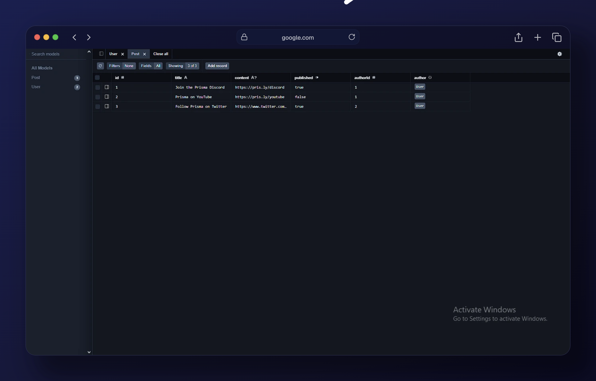

# Prisma (Stater lesson)
Prisma ORM is a next-generation Node.js and TypeScript ORM that unlocks a new level of developer experience when working with databases thanks to its intuitive data model, automated migrations, type-safety & auto-completion.

## Getting started with prisma (phase1)

<p align="center">
    <a href="#" style="display: block;" align="center">
        
    </a>
</p>

The perequisites for this starter project includes:
- Node.js 18+ installed
- A Prisma Postgres database (or any PostgreSQL database)
- A Vercel account (if you want to deploy your application)

## Begin to setup the Next.JS project
for the completeness of the project we install these:
1. TypeScript
2. ESLint
3. Tailwind CSS
4. No `src` directory
5. App router
6. Turbopack
7. No customized import alias
Then navigate to your project directory

## Setting up the Prisma (ORM)

<p align="center">
    <a href="#" style="display: block;" align="center">
        
    </a>
</p>

First, we need to install a few dependencies. 
```bash
npm install prisma --save-dev
npm install tsx --save-dev
npm install @prisma/extension-accelerate
```
we'll be using a Prisma Postgrese database so we're going to use the  ` @prisma/extension-accelerate` package.

Next we run `prisma init` to initialize the prisma ORM in our project.

```bash
npx prisma init
```
In the new `prisma` directory comes with a schema.prisma file inside it, this is where we define the database models.

```typescript
generator client {
  provider = "prisma-client-js"
}

datasource db {
  provider = "postgresql"
  url      = env("DATABASE_URL")
}

model User {
  id    Int     @id @default(autoincrement())
  email String  @unique
  name  String?
  posts Post[]
}

model Post {
  id        Int     @id @default(autoincrement())
  title     String
  content   String?
  published Boolean @default(false)
  authorId  Int
  author    User    @relation(fields: [authorId], references: [id])
}
```
This represents a blog posts with each post having a user as an author and each user can have many post's.

### Save the Database connection string
with the Prisma Postgrs we have a `DATABASE_URL` that you store in the .`env` file.

```bash
DATABASE_URL = "Your URL"
```
save the database connection string and apply the schema to the database `using prisma migrate dev`

```bash
npx prisma migrate dev --name init
```

## Output



## Getting started with prisma (phase 2)

<p align="center">
    <a href="#" style="display: block;" align="center">
        
    </a>
</p>

### Setting up Prisma Client
The Database has some initial data, setting up the prisma Client and connect it to our database.

```typescript
import { PrismaClient } from '@prisma/client'
import { withAccelerate } from '@prisma/extension-accelerate'

const prisma = new PrismaClient().$extends(withAccelerate())

const globalForPrisma = global as unknown as { prisma: typeof prisma }

if (process.env.NODE_ENV !== 'production') globalForPrisma.prisma = prisma

export default prisma
```
This will create a Prisma Client and attach it to the global object so that only one instance of the client is created for the application. This will resolve issues with hot reloading that can occur when using Prisma ORM with Next.js in development mode.

## Query the Database with Prisma ORM
Inside the app directory :

```typescript
export default async function Home() {
  return (
    <div className="min-h-screen bg-gray-50 flex flex-col items-center justify-center -mt-16">
      <h1 className="text-4xl font-bold mb-8 font-[family-name:var(--font-geist-sans)] text-[#333333]">
        Superblog
      </h1>
      <ol className="list-decimal list-inside font-[family-name:var(--font-geist-sans)]">
        <li className="mb-2">Alice</li>
        <li>Bob</li>
      </ol>
    </div>
  );
}
```
This is a basic page with a title and a list of users. However, that list is static and doesn't change

The client is imported
```typescript
import prisma from '@/lib/prisma'
``` and queried the `User` model for all the users,
```typescript
 const users = await prisma.user.findMany();
```
and it will display them in a list
```typescript
         {users.map((user) => (
          <li key={user.id} className="mb-2">
            {user.name}
          </li>
        ))}
```

## Add a Posts detail page
Inside the directory I've created a new `[id]` directory and a new `page.tsx` file inside of that.

```typescript
import prisma from "@/lib/prisma";

export default async function Post({ params }: { params: Promise<{ id: string }> }) {
  return (
    <div className="min-h-screen bg-gray-50 flex flex-col items-center justify-center -mt-16">
      <article className="max-w-2xl space-y-4 font-[family-name:var(--font-geist-sans)]">
        <h1 className="text-4xl font-bold mb-8 text-[#333333]">My first post</h1>
        <p className="text-gray-600 text-center">by Anonymous</p>
        <div className="prose prose-gray mt-8">
          No content available.
        </div>
      </article>
    </div>
  );
}
```

Just like before the page is static so updating it with params that are added to the page.

We're using Prisma Client to fetch the post by its id, which we get from the params object.

```typescript
  const { id } = await params;
  const post = await prisma.post.findUnique({
    where: { id: parseInt(id) },
    include: {
      author: true,
    },
  });

  if (!post) {
    notFound();
  }
```

In case the post doesn't exist (maybe it was deleted or maybe you typed a wrong ID), I've called notFound() to display a 404 page.

```typescript
import { notFound } from "next/navigation";
```

We then display the post's title, content, and author. If the post doesn't have content, we display a placeholder message.

```typescript
        <h1 className="text-4xl font-bold mb-8 text-[#333333]">{post.title}</h1>
        <p className="text-gray-600 text-center">by {post.author.name}</p>
        <div className="prose prose-gray mt-8">
          {post.content || "No content available."}
```

## Getting started with prisma (Final phase)

<p align="center">
    <a href="#" style="display: block;" align="center">
        
    </a>
</p>

### New posts crrete page
Rounding up the pisma-application, adding a "create" page for posts. This will let us write our own posts and save them to the database.

```bash
mkdir -p app/posts/new && touch app/posts/new/page.tsx
```
this will create the page

```typescript
import Form from "next/form";
import prisma from "@/lib/prisma";
import { revalidatePath } from "next/cache";
import { redirect } from "next/navigation";

export default function NewPost() {
  async function createPost(formData: FormData) {
    "use server";

    const title = formData.get("title") as string;
    const content = formData.get("content") as string;

    await prisma.post.create({
      data: {
        title,
        content,
        authorId: 1,
      },
    });

    revalidatePath("/posts");
    redirect("/posts");
  }

  return (
    <div className="max-w-2xl mx-auto p-4">
      <h1 className="text-2xl font-bold mb-6">Create New Post</h1>
      <Form action={createPost} className="space-y-6">
        <div>
          <label htmlFor="title" className="block text-lg mb-2">
            Title
          </label>
          <input
            type="text"
            id="title"
            name="title"
            placeholder="Enter your post title"
            className="w-full px-4 py-2 border rounded-lg"
          />
        </div>
        <div>
          <label htmlFor="content" className="block text-lg mb-2">
            Content
          </label>
          <textarea
            id="content"
            name="content"
            placeholder="Write your post content here..."
            rows={6}
            className="w-full px-4 py-2 border rounded-lg"
          />
        </div>
        <button
          type="submit"
          className="w-full bg-blue-500 text-white py-3 rounded-lg hover:bg-blue-600"
        >
          Create Post
        </button>
      </Form>
    </div>
  );
}
```

This is a functional form. When submitted the form, will create a new post in the database and redirect to the posts list page.
`revalidatePath` call is added used to revalidate the posts list page so that it will be updated with the new post.


This creates an initial migration creating the User and Post tables and applies that migration to the database.

This is a [Next.js](https://nextjs.org) project bootstrapped with [`create-next-app`](https://nextjs.org/docs/app/api-reference/cli/create-next-app).

## Getting Started

First, run the development server:

```bash
npm run dev
# or
yarn dev
# or
pnpm dev
# or
bun dev
```

Open [http://localhost:3000](http://localhost:3000) with your browser to see the result.

You can start editing the page by modifying `app/page.tsx`. The page auto-updates as you edit the file.

This project uses [`next/font`](https://nextjs.org/docs/app/building-your-application/optimizing/fonts) to automatically optimize and load [Geist](https://vercel.com/font), a new font family for Vercel.

## Learn More

To learn more about Next.js, take a look at the following resources:

- [Next.js Documentation](https://nextjs.org/docs) - learn about Next.js features and API.
- [Learn Next.js](https://nextjs.org/learn) - an interactive Next.js tutorial.

You can check out [the Next.js GitHub repository](https://github.com/vercel/next.js) - your feedback and contributions are welcome!

## Deploy on Vercel

The easiest way to deploy your Next.js app is to use the [Vercel Platform](https://vercel.com/new?utm_medium=default-template&filter=next.js&utm_source=create-next-app&utm_campaign=create-next-app-readme) from the creators of Next.js.

Check out our [Next.js deployment documentation](https://nextjs.org/docs/app/building-your-application/deploying) for more details.
